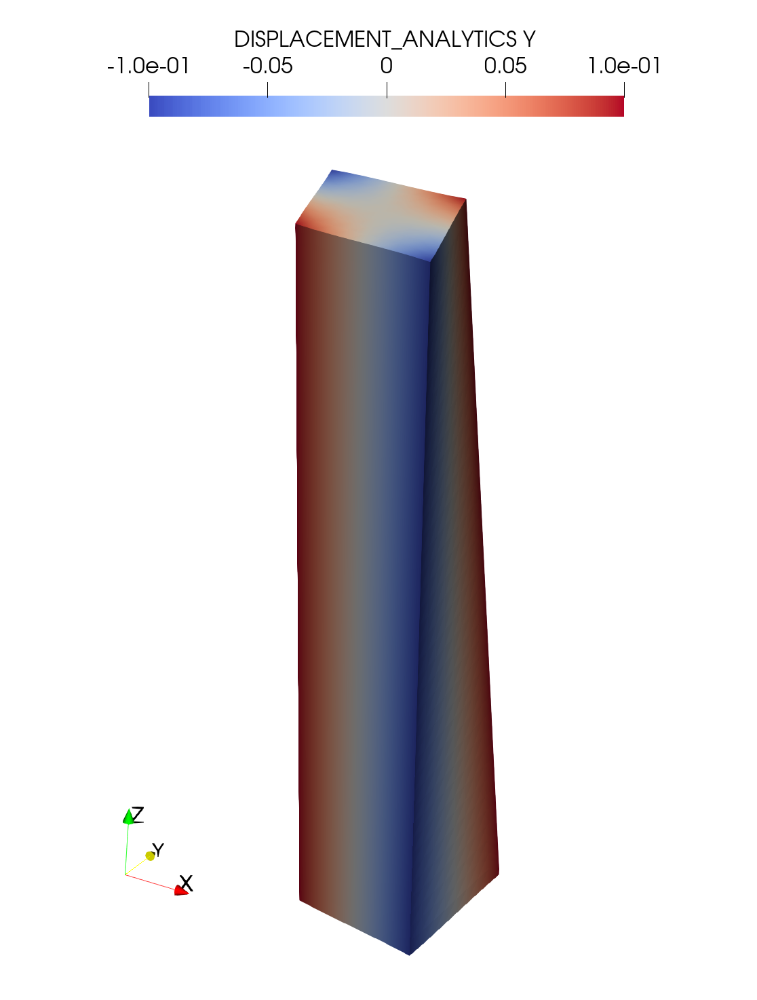

# Elasticity-problems
Elasticity Problems

Для моделирования сдвига бруска будем решать задачу линейной упругости (в приближении малых деформаций):

<h3 align="center">$div \sigma = -\vec{b},$ $\sigma = C:\epsilon,$ $\epsilon = \frac{ \nabla \vec{u} + \nabla {\vec{u}}^{T}}{2}$

где $\vec{u} = (u, v, w)$ - смещение точки, $\vec{b}$ - вектор результирующих приложенных к телу внешних сил,
$\epsilon$ - тензор малых деформаций, $С$ - тензор жесткости

с граничными условиями:

<h3 align="center">$\alpha \vec{u} - \beta \sigma \vec{n} = \vec{\gamma}$

где $\alpha -$ тензор 3-го порядка, условия типа Дирихле, $\alpha$ = ${\alpha}_{\bot} n n^{T}$ - ${\alpha} _{||}$ $(n n^{T} - \mathbb{I})$

$\beta -$ тензор 3-го порядка, условия типа Неймана, $\beta$ = ${\beta}_{\bot} n n^{T}$ - $\beta _{||} (n n^{T} - \mathbb{I})$

# Задача о сдвиге бруска
Рассмотрим задачу о сдвиге бруска. Изначально брусок размером $xyz = [-1, 1]x[-1,1]x[0, L]$ находится в недеформированном состоянии. К верхней грани прикладывается сила $[0, -F, 0]$. К боковым граням бруска приложена нулевая сила. Смещения \vec{u} на нижней грани бруска зафиксированы. Необходимо определить итоговое поле напряжений $\sigma$ и смещений $\vec{u}$ во всем бруске.

Численное решение осуществляется путем дискретизации уравнений методом конечных объемов (МКО) на дуальной сетке (смещения $\vec{u}$ расположены в узлах исходной сетки и в центрах дуальных ячеек) с использованием 
<a href="https://github.com/INMOST-DEV/INMOST ">INMOST</a>

Для данной задачи существует <a href="https://www.sciencedirect.com/science/article/abs/pii/S0045782514001509?via%3Dihub" target="_blank">аналитическое решение</a>

Граничные условия:

На нижней грани $\vec{n}$ = (0, 0, -1))  по аналитическому решению задаются смещения $\vec{\gamma}$ = $\vec{u}_{an}$, то есть $\alpha _{||} = \alpha _{\bot} = 1$, 
$\beta _{||} = \beta _{\bot} = 0$, таким образом, $\alpha = \mathbb{I}$, $\beta = 0$. 

На верхней грани задается сила, рассчитанная по аналитическому решению для
тензора напряжения $\sigma _{an}$, $\vec{\gamma}$ = $\vec{t}$ = $\sigma _{an} \vec{n}$, то есть $\beta _{||} = \beta _{\bot} = 1$, $\alpha _{||} = \alpha _{\bot} = 0$,
таким образом, $\alpha = 0$, $\beta = \mathbb{I}$

Сравнение аналитического решения с численным на сетке $N_{x} = N_{y} = 10, N_{z} = 20$:

<h1 align="center"> Смещение $u$
  
Численное решение |  Аналитическое решение
:-------------------------:|:-------------------------:
  |  

<h1 align="center"> Компонента ${\sigma}_{zz}$ тензора напряжений $\sigma$
  
Численное решение$ |  Аналитическое решение
:-------------------------:|:-------------------------:
  |  

Из графиков сравнения численного и аналитического решений видим, что визуально решения хорошо совпадают.

Отклонение аналитического решения от численного рассчитывается как L2-norm:

Анализ сходимости:

| $h=dx=dy=dz$  |  L2-norm $u$ | L2-norm $\sigma$ | Порядок аппроксимации схемы $p$ по L2-norm- $\vec{u}$ | Порядок аппроксимации схемы $p$ по L2-norm- $\sigma$ |
| ------------- | ------------- | ------------- | ------------- | ------------- |
| 1  | $0.21$   | $0.16$  | -  |  -  |
| 0.5  | $0.084$ | $0.072$ | $1.32$  | $1.15$  |
| 0.25  | $0.025$ | $0.023$ | $1.75$  | $1.6$  |
| 0.125  | $0.0066$ | $0.0063$ | $1.9$  | $1.86$  |

Порядок схемы $p$ рассчитывается по формуле $p = \frac{ ln ( err _{h} / err _{2h} )}{ln(2h/h)}$

Порядок схемы рассчитанный по L2-norm для $u$ и для $p$ лежит в диапазоне между 1-ым и 2-ым. Порядок схемы, рассчитанный по L2-norm для $u$ выше, это связано с тем, что
для дискретизации градиента смещений используется пятиточеченый шаблон.

# Задача о кручении бруска

<h1 align="center"> Смещение $u$ вдоль оси $y$
  
Численное решение |  Аналитическое решение
:-------------------------:|:-------------------------:
  |  
