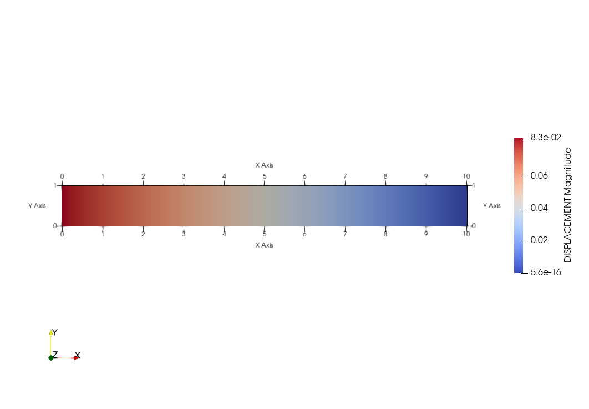
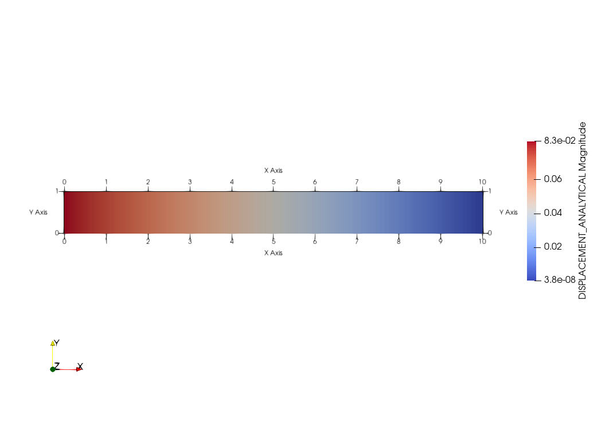
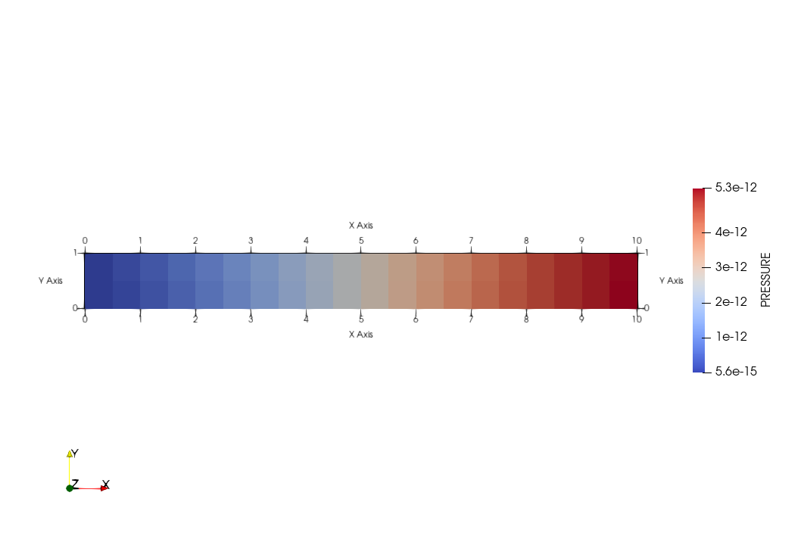
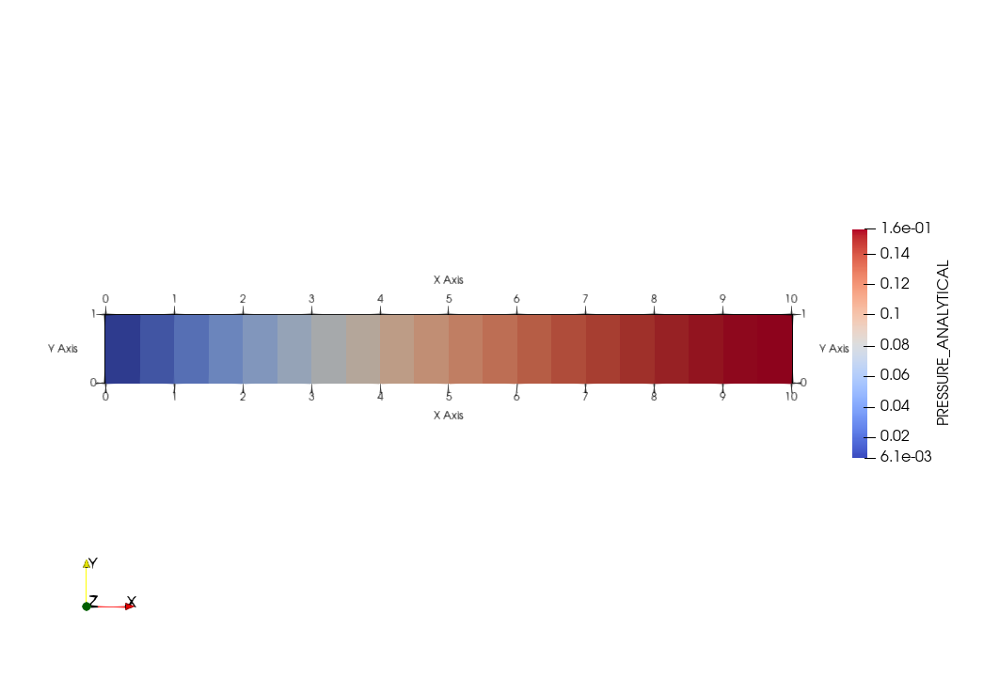

# Задача Био
Задача фильтрации однофазной жидкости в пороупругой среде может быть описана с помощью дифференциальных уравнений:

<h3 align="center">$div ( C:\epsilon - \alpha \mathbb{I} p) = -\vec{b}$, $\epsilon = \frac{ \nabla \vec{u} + \nabla {\vec{u}}^{T}}{2}$

<h3 align="center"> $\frac{\partial \phi}{\partial t} - div(\mathbb{K} \nabla p) = q$

где $\vec{u} = (u, v, w)$ - смещение точки, $\vec{b}$ - вектор результирующих приложенных к телу внешних сил,

$\epsilon$ - тензор малых деформаций, $С$ - тензор жесткости,

$\alpha$ - коэффициент Био, $p$ - давление жидкости в порах,

$\phi = \phi _{0} + \alpha div(\vec{u}) + \frac{(\alpha - \phi _{0})}{K} p$ - пористость с учетом деформаций,

$\phi _{0}$ - исходная пористость, $K$ - модуль объемного расширения,

$q$ - источник или сток, $\mathbb{K}$ - тензор второго ранга абсолютной проницаемости породы

с граничными условиями:

<h4 align="center">$\alpha \vec{u} - \beta \sigma \vec{n} = \vec{\gamma}$ - условия на смещение $\vec{u}$
<h4 align="center">$Ap + B {\vec{n}}^{T} K \nabla p = C$ - условия на давление $p$

где $A$ - условие на давление жидкости (условия типа Дирихле),
$B$ - условия на поток жидкости (условия типа Неймана),
$C$ - значение давление или потока жидкости

где $\alpha -$ тензор 3-го порядка, условия типа Дирихле, $\alpha$ = ${\alpha}_{\bot} n n^{T}$ - ${\alpha}{||}$ $(n n^{T} - \mathbb{I})$

$\beta -$ тензор 3-го порядка, условия типа Неймана, $\beta$ = ${\beta}_{\bot} n n^{T}$ - $\beta{||} (n n^{T} - \mathbb{I})$

# Задача Терцаги
Пассмотрим задачу фильтрации жидкости в насыщенной пористой среде, находящейся под воздействием нагрузки (среду сдавливают). Насыщенная пористая среда представляет собой параллелипипед размером $xyz = [0, 1]x[0,1]x[0, L = 10]$ и изначально находится в недеформированном состоянии. 
К левой грани прикладывается сдавливающая сила $[F, 0, 0]$. Смещения \vec{u} на правой грани зафиксированы, а на верхней и нижней границах для $\vec{u}$ ставятся условия скольжения.
Давление на левой границе $p(0, t) = 0$, а на остальных границах условия непротекания.
Необходимо определить итоговое поле давления жидкости в порах $p$ и поле смещений породы $\vec{u}$ во всей области.

Численное решение осуществляется путем дискретизации уравнений методом конечных объемов (МКО) на дуальной сетке (смещения $\vec{u}$ расположены в узлах исходной сетки и в центрах дуальных ячеек) с использованием 
<a href="https://github.com/INMOST-DEV/INMOST ">INMOST</a>

Для данной задачи существует <a href="https://keldysh.ru/papers/2017/prep2017_81.pdf">аналитическое решение</a>

В численном решении задаются граничные условия следующим образом:

Условия на давление:

Условия непротекания: $\nabla p = 0$, таким образом $B = 1, A = 0, C = 0$

Условие $p(0, t) = 0$ на левой границе: $B = 0, A = 1, C = 0$

Условия на силы и смещения:

Действие силы $F = 0.1$ (для левой границы): $\vec{\gamma} = (F, 0, 0)$, $\alpha _{||} = \alpha _{\bot} = 0$,  $\beta _{||} = \beta _{\bot} = 1$, 
таким образом, $\alpha = 0$, $\beta = \mathbb{I}$

Фиксированные смещения (для правой границы): $\vec{\gamma} = (0, 0, 0)$, $\alpha _{||} = \alpha _{\bot} = 1$,  $\beta _{||} = \beta _{\bot} = 0$, 
таким образом, $\alpha = \mathbb{I}$, $\beta = 0$

Условия скольжения (верхняя и нижняя границы): $\vec{\gamma} = (0, 0, 0)$, $\alpha _{||} = \beta _{\bot} = 0$, $\alpha _{\bot} = \beta _{||} = 1$

Начальные условия

Задаются в момент времени $t = 0$ по <a href="https://keldysh.ru/papers/2017/prep2017_81.pdf">аналитическому решению</a>

Сравнение аналитического решения с численным на сетке $N_{x} = N_{y} = 2, N_{z} = 10$:

<h1 align="center"> Смещение породы $u$
  
Численное решение$ |  Аналитическое решение
:-------------------------:|:-------------------------:
  |  

<h1 align="center"> Давление жидкости в порах $p$
  
Численное решение |  Аналитическое решение
:-------------------------:|:-------------------------:
  |  

Из графиков сравнения численного и аналитического решений видим, что визуально решения хорошо совпадают.

Отклонение аналитического решения от численного рассчитывается как L2-norm:

Анализ сходимости:

| dx=dy=dz  |  L2-norm $u$ | L2-norm $\p$ | Порядок аппроксимации схемы $p$ по L2-norm-$\sigma$ |
| ------------- | ------------- | ------------- | ------------- |
| 1  | $0.0018$  | $0.046$  | -  |
| 0.5  | $0.00036$  | $0.023$  | $1$  |
| 0.25  | $0.00043$  | $0.011$  | $1.06$  |

