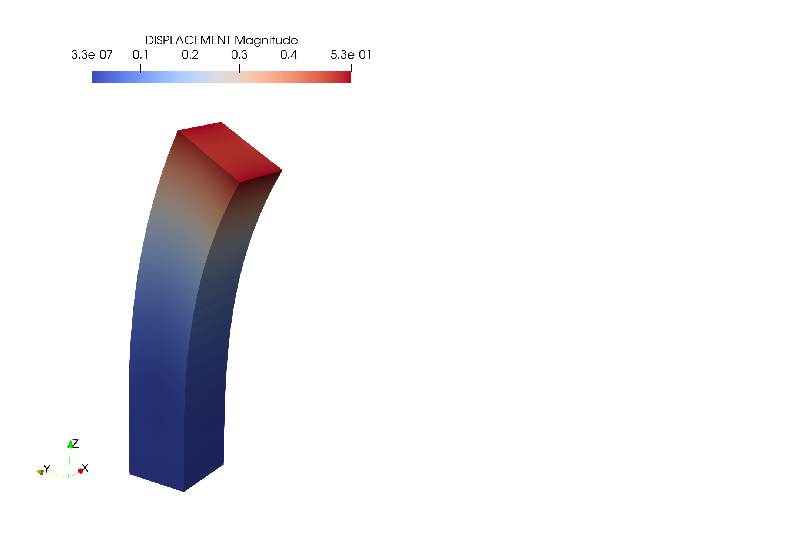
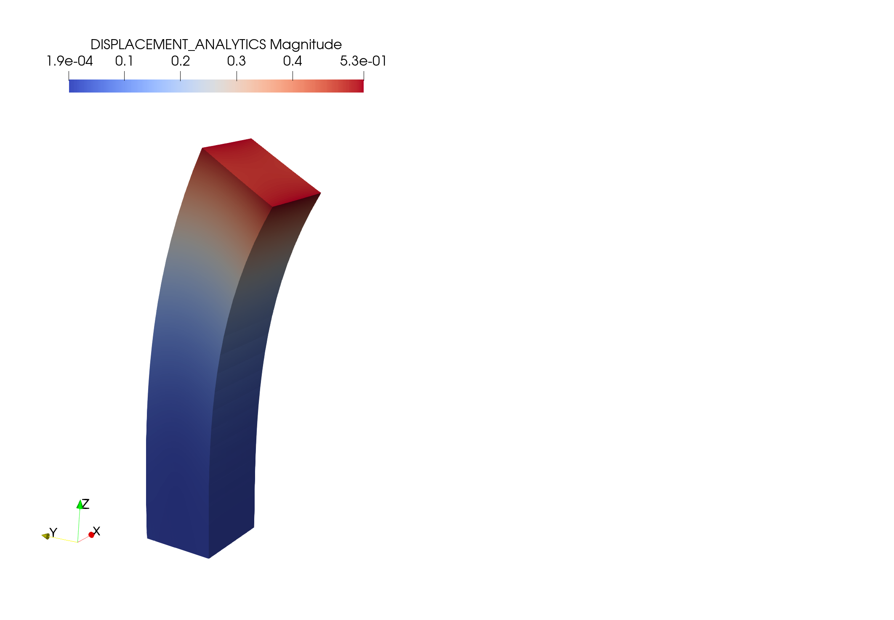
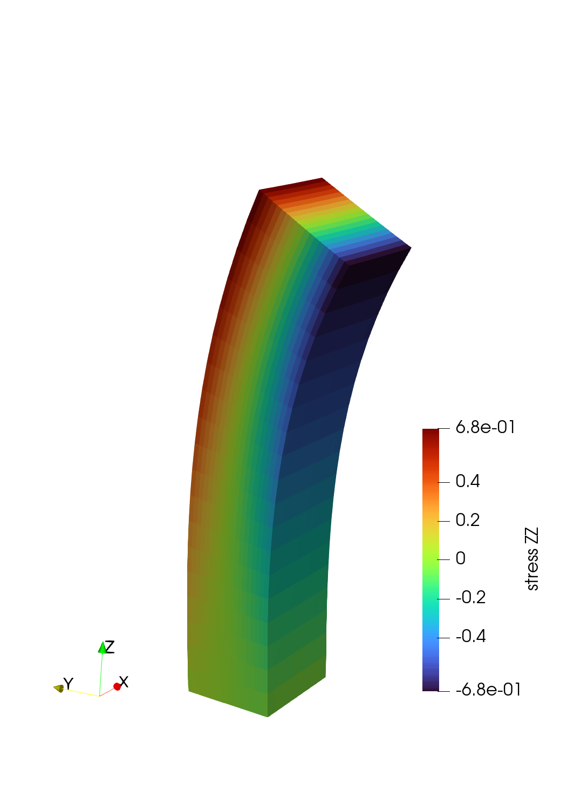
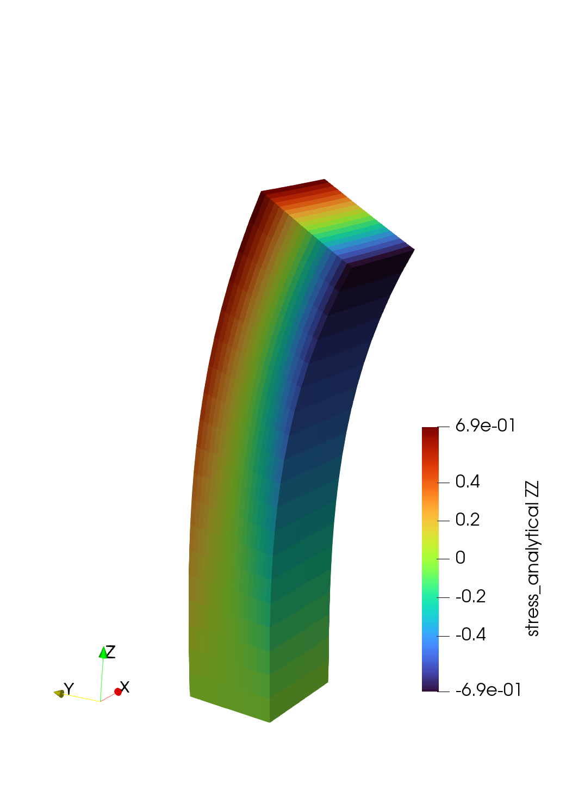

# Elasticity-problems
Elasticity Problems

Для моделирования сдвига бруска будем решать задачу линейной упругости (в приближении малых деформаций):

<h3 align="center">$div \vec{u} = -\vec{b},$ $\sigma = C:\epsilon,$ $\epsilon = \frac{ \nabla \vec{u} + \nabla {\vec{u}}^{T}}{2}$

где $\vec{u} = (u, v, w)$ - смещение точки, $\vec{b}$ - вектор результирующих приложенных к телу внешних сил,
$\epsilon$ - тензор малых деформаций, $С$ - тензор жесткости

с граничными условиями:

<h3 align="center">$\alpha \vec{u} - \beta \sigma \vec{n} = \vec{\gamma}$

где $\alpha -$ тензор 3-го порядка, условия типа Дирихле, $\alpha$ = ${\alpha}_{\bot} n n^{T}$ - $\alpha{||} (n n^{T} - \mathbb{I})$

$\beta -$ тензор 3-го порядка, условия типа Неймана, $\beta$ = ${\beta}_{\bot} n n^{T}$ - $\beta{||} (n n^{T} - \mathbb{I})$

# Задача о сдвиге бруска
Рассматрим задачу о сдвиге бруска. Изначально брусок размером $xyz = [-1, 1]x[-1,1]x[0, L]$ находится в недеформированном состоянии. К верхней грани прикладывается сила $[0, -F, 0]$. К боковым граням бруска приложена нулевая сила. Смещения \vec{u} на нижней грани бруска зафиксированы. Необходимо определить итоговое поле напряжений $\sigma$ и смещений $\vec{u}$ во всем бруске.

Численное решение осуществляется путем дискретизации уравнений методом конечных объемов (МКО) на дуальной сетке (смещения $\vec{u}$ расположены в узлах исходной сетки и в центрах дуальных ячеек) с использованием 
<a href="https://github.com/INMOST-DEV/INMOST ">INMOST</a>

Для данной задачи существует <a href="https://www.sciencedirect.com/science/article/abs/pii/S0045782514001509?via%3Dihub" target="_blank">аналитическое решение</a> ${\vec{u}}_{an}$ и ${\sigma}_{an}$

Сравнение аналитического решения с численным на сетке $N_{x} = N_{y} = 10, N_{z} = 20$:

<h1 align="center"> Смещение $u$
  
Численное решение |  Аналитическое решение
:-------------------------:|:-------------------------:
  |  

<h1 align="center"> Компонента ${\sigma}_{zz}$ тензора напряжений $\sigma$
  
Численное решение$ |  Аналитическое решение
:-------------------------:|:-------------------------:
  |  

Отклонение аналитического решения от численного рассчитывается как L2-norm:

$||\vec{u}_{an} - \vec{u}||_{L2} =$
Анализ сходимости:

| dx=dy=dz  |  L2-norm u | L2-norm $\sigma$ | Порядок аппроксимации схемы $p$ по L2-norm-$\sigma$ |
| ------------- | ------------- | ------------- | ------------- |
| 1  | $0.0018$  | $0.046$  | -  |
| 0.5  | $0.00036$  | $0.023$  | $1$  |
| 0.25  | $0.00043$  | $0.011$  | $1.06$  |

L2-norm для $u$ падает быстро с измельчением сетки, а затем перестает падать и значительно изменяться (?).
Порядок схемы, рассчитанный по норме $L2-norm$ давления $\sigma$ примерно равен 1
